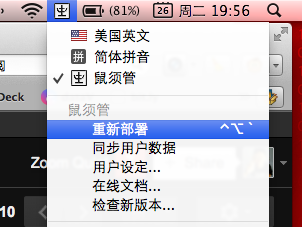

表形码 在 鼠须管|Squirrel
====================================

[表形码](http://zh.wikipedia.org/wiki/%E8%A1%A8%E5%BD%A2%E7%A0%81)
一款异常优秀的输入法！

- 但是随着市场的变迁,被和谐了...
- 俺用得非常爽! 从 M$/Ubuntu/MAC 一路伴随
- 在MAC 中,原先是通过内置外挂码表功能的 IMKQIM
    - 作者 Glider 很勤奋,凡是俺吐糟的邮件都尽量详细回复了
    - 但是 QIM 毕竟专注拼音的联想/整句输入,对于形码关注不大
    - 除了经常崩溃外,神奇的 i 模式也经常将输入折腾乱
- 终于,有 ifanr 好友推荐: [鼠须管，“神级”输入法](http://www.ifanr.com/156409)
    - 终于忍受 QIM 不能,用一晩迁移了过来...

参考
------------------

佛振先生的大作: [rimeime - 中州韻輸入法引擎 | Rime Input Method Engine - Google Project Hosting](http://code.google.com/p/rimeime/)

想自制全新的输入法,必须学习的:

- [UserGuide - rimeime - 說明書 - 中州韻輸入法引擎 | Rime Input Method Engine - Google Project Hosting](http://code.google.com/p/rimeime/wiki/UserGuide)
- [CustomizationGuide - rimeime - Rime 定製指南 - 中州韻輸入法引擎 | Rime Input Method Engine - Google Project Hosting](http://code.google.com/p/rimeime/wiki/CustomizationGuide)

然后针对性找到了靠谱的实操记要:

- [鼠须管导入词库的方法_Fuckintosh HD](http://fuckintosh.diandian.com/post/2012-12-22/40046424201)
- [鼠须管输入法导入搜狗细胞词库 | 跑马圈地](http://www.ukuang.com/2012/10/13/%E9%BC%A0%E9%A1%BB%E7%AE%A1%E8%BE%93%E5%85%A5%E6%B3%95%E5%AF%BC%E5%85%A5%E6%90%9C%E7%8B%97%E7%BB%86%E8%83%9E%E8%AF%8D%E5%BA%93/)
- [如何从QIM迁移至Squirrel（鼠鬚管） - CocoaBob](http://cocoabob.net/?p=919)

表形码自学资料下载: [BXM-新编电脑打字七日通(全民版)](https://github.com/ZoomQuiet/ZqBXM/raw/master/BXM_%E6%89%93%E5%AD%97%E4%B8%83%E6%97%A5%E9%80%9A_%E5%85%A8%E6%B0%91%E7%89%88.pdf)

自制
------------------

当前方案相关文档说明 ./ 

-   +-- 2006-bxm4zq.bin.user.txt 从win98时代扒出来,一步步完善的个人BXM 码表
-   +-- README.md               本文
-   +-- alternative.yaml        来自 http://gist.github.com/2334409
-   +-- bxm.qim.txt             MAC 时代感 给QIM 使用的码表
-   +-- bxm4zq2mac.custom.yaml  自制表形码方案定制声明
-   +-- bxm4zq2mac.dict.yaml    自制表形码方案字典
-   +-- bxm4zq2mac.schema.yaml  自制表形码方案声明
-   +-- fix2Squirrel4BXM.py     QIM->Squirrel 码表格式转换脚本

如果想部属在你自个儿的环境中,如下简要流程:

- 将方案相关文件复制到 `~/Library/Rime/` :

    alternative.yaml
    bxm4zq2mac.custom.yaml
    bxm4zq2mac.dict.yaml
    bxm4zq2mac.schema.yaml

- 进入 `~/Library/Rime/` 配置 `默许配置` ~ `default.yaml` ::

        schema_list:
          - schema: bxm4zq2mac
          - schema: luna_pinyin_simp
        #  - schema: luna_pinyin
        #  - schema: cangjie5
        #  - schema: luna_pinyin_fluency

- 即关闭不用的输入方案,就保留 简体拼音以及自个儿的BXM
- 点击输入法状态图标点开后 `重新部署`  

- 观察 `$TMPDIR/rime.squirrel.INFO` 见到以下类似的,就说明加载正确::
        
        I0326 16:21:23.431095 23597056 deployment_tasks.cc:148] schema: bxm4zq2mac
        I0326 16:21:23.431114 23597056 config.cc:551] loading config file '/Users/zoomq/Library/Rime/bxm4zq2mac.schema.yaml'.
        I0326 16:21:23.443059 23597056 config.cc:551] loading config file '/Users/zoomq/Library/Rime/bxm4zq2mac.schema.yaml'.
        I0326 16:21:23.444592 23597056 customizer.cc:85] config file '/Users/zoomq/Library/Rime/bxm4zq2mac.schema.yaml' is up-to-date.
        I0326 16:21:23.444665 23597056 config.cc:551] loading config file '/Users/zoomq/Library/Rime/bxm4zq2mac.schema.yaml'.
        ...

增补
------------------

鼠须管目前没有提供 SCIM 那样随时抓字为用户词典的功能,
所以,一但发觉有新近的常用词后,只能手工增补到方案字典中,可以如下处置:

- 手工编辑 `bxm.qim.txt` 将词条根据字母排序,合理插入到相应行,格式为:

    词条 [空格] 码值

- 然后调用转换脚本 ::

        $ python fix2Squirrel4BXM.py bxm.qim.txt
        bxm.qim.txt
        #   BASE bxm2006zq for Ubuntu
        #   - 120105 Zoom.Quiet testing why chaos...
        #   - 111231 Zoom.Quiet appended +3 user words
        #   - 111229 Zoom.Quiet appended 300 user words from Ubuntu SCIM
        #   - 111221 Zoom.Quiet creat for BXM jump in QIM
        #EN
             共处理:60121 行
        >>>输出为: bxm4zq2mac.dict.txt

- 最后将增补成功的 `bxm4zq2mac.dict.txt` 复制到 `~/Library/Rime/` 重新部属生成新的相关数据就好!

