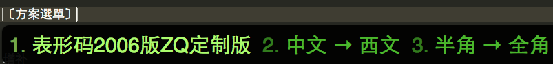

# 表形码 在 鼠须管/Squirrel

[表形码](http://zh.wikipedia.org/wiki/%E8%A1%A8%E5%BD%A2%E7%A0%81)
一款异常优秀的输入法！

- 但是随着市场的变迁,被和谐了...
- 俺用得非常爽! 从 M$/Ubuntu/MAC 一路伴随
- 在MAC 中,原先是通过内置外挂码表功能的 IMKQIM
    - 作者 Glider 很勤奋,凡是俺吐糟的邮件都尽量详细回复了
    - 但是 QIM 毕竟专注拼音的联想/整句输入,对于形码关注不大
    - 除了经常崩溃外,神奇的 i 模式也经常将输入折腾乱
- 终于,有 ifanr 好友推荐: [鼠须管，“神级”输入法](http://www.ifanr.com/156409)
    - 终于忍受 QIM 不能,用一晩迁移了过来...

## 参考

佛振先生的大作: [rimeime - 中州韻輸入法引擎 | Rime Input Method Engine - Google Project Hosting](http://code.google.com/p/rimeime/)

想自制全新的输入法,必须学习的:

- [UserGuide - rimeime - 說明書 - 中州韻輸入法引擎 | Rime Input Method Engine - Google Project Hosting](http://code.google.com/p/rimeime/wiki/UserGuide)
- [CustomizationGuide - rimeime - Rime 定製指南 - 中州韻輸入法引擎 | Rime Input Method Engine - Google Project Hosting](http://code.google.com/p/rimeime/wiki/CustomizationGuide)


然后针对性找到了靠谱的实操记要:

- [鼠须管导入词库的方法_Fuckintosh HD](http://fuckintosh.diandian.com/post/2012-12-22/40046424201)
- [鼠须管输入法导入搜狗细胞词库 | 跑马圈地](http://www.ukuang.com/2012/10/13/%E9%BC%A0%E9%A1%BB%E7%AE%A1%E8%BE%93%E5%85%A5%E6%B3%95%E5%AF%BC%E5%85%A5%E6%90%9C%E7%8B%97%E7%BB%86%E8%83%9E%E8%AF%8D%E5%BA%93/)
- [如何从QIM迁移至Squirrel（鼠鬚管） - CocoaBob](http://cocoabob.net/?p=919)


表形码自学资料下载: [BXM-新编电脑打字七日通(全民版)](https://github.com/ZoomQuiet/ZqBXM/raw/master/BXM_%E6%89%93%E5%AD%97%E4%B8%83%E6%97%A5%E9%80%9A_%E5%85%A8%E6%B0%91%E7%89%88.pdf)


## 自制

当前方案相关文档说明 ./ 

-   +-- 2006-bxm4zq.bin.user.txt 从win98时代扒出来,一步步完善的个人BXM 码表
-   +-- bxm.qim.txt             MAC 时代感 给QIM 使用的码表
-   +-- bxm4zq2mac.dict.yaml    bxm4zq2mac 方案字典
-   +-- bxm4zq2mac.schema.yaml  bxm4zq2mac 方案声明
-   +-- bxm4zq2mac.custom.yaml  bxm4zq2mac 方案定制声明
-   +-- fix2Squirrel4BXM.py     QIM->Squirrel 码表格式转换脚本
-   +-- README.md               本文
-   +-- alternative.yaml        来自 http://gist.github.com/2334409 纯E文标点集
-   +-- default.custom.yaml     bxm4zq2mac 对应的用户默许配置
-   +-- squirrel.custom.yaml    bxm4zq2mac 对应的全局配置


如果想部属在你自个儿的环境中,如下简要流程:

- 将方案相关文件复制到 `~/Library/Rime/` :

    alternative.yaml
    bxm4zq2mac.dict.yaml
    bxm4zq2mac.schema.yaml
    bxm4zq2mac.custom.yaml
    default.custom.yaml
    squirrel.custom.yaml


- 点击输入法状态图标点开后 `重新部署`  


- 观察 `$TMPDIR/rime.squirrel.INFO` 见到以下类似的,就说明加载正确::
        
        I0326 16:21:23.431095 23597056 deployment_tasks.cc:148] schema: bxm4zq2mac
        I0326 16:21:23.431114 23597056 config.cc:551] loading config file '/Users/zoomq/Library/Rime/bxm4zq2mac.schema.yaml'.
        I0326 16:21:23.443059 23597056 config.cc:551] loading config file '/Users/zoomq/Library/Rime/bxm4zq2mac.schema.yaml'.
        I0326 16:21:23.444592 23597056 customizer.cc:85] config file '/Users/zoomq/Library/Rime/bxm4zq2mac.schema.yaml' is up-to-date.
        I0326 16:21:23.444665 23597056 config.cc:551] loading config file '/Users/zoomq/Library/Rime/bxm4zq2mac.schema.yaml'.
        ...

- 按下`Alt+\` ` 应该见到生效后的选单  




## 增补

鼠须管目前没有提供 SCIM 那样随时抓字为用户词典的功能,
所以,一但发觉有新近的常用词后,只能手工增补到方案字典中,可以如下处置:

- 手工编辑 `bxm.qim.txt` 将词条根据字母排序,合理插入到相应行,格式为:

    词条 [空格] 码值

- 然后调用转换脚本 ::

        $ python fix2Squirrel4BXM.py bxm.qim.txt
        bxm.qim.txt
        #   BASE bxm2006zq for Ubuntu
        #   - 120105 Zoom.Quiet testing why chaos...
        #   - 111231 Zoom.Quiet appended +3 user words
        #   - 111229 Zoom.Quiet appended 300 user words from Ubuntu SCIM
        #   - 111221 Zoom.Quiet creat for BXM jump in QIM
        #EN
             共处理:60121 行
        >>>输出为: bxm4zq2mac.dict.txt


- 最后将增补成功的 `bxm4zq2mac.dict.txt` 复制到 `~/Library/Rime/` 重新部属生成新的相关数据就好!


### 230305
> 作为 Rust 练习, 将原先 Python 版本的码表管理工具, 转化为编译执行工具版本

- 仓库: [zhrust/BXMr at v0.3.42](https://github.com/zhrust/BXMr/tree/v0.3.42)
- 发布: [bxmr - crates.io: Rust Package Registry](https://crates.io/crates/bxmr)
- 故事: [BXMr - be Rustaceans](https://rs.101.so/dev/cli_bxmr.html#trace)

毕竟 rIME 本身并没有提供自定义词语的快速管理功能, 那就得自己来了...
当前的使用流程:

```
BXMr Usage:
0: must setup .env for all Commands;
    $ bxmr cfg yaml path/2/u/local/bxm4zq2mac.dict.yaml
        ~ point u rIME-Squirrel usage .yaml
    $ bxmr cfg toml path/2/u/local/bxmr_loc_temp.toml
        ~ point u local temporary .toml, BXMr need this for cache data

> daily usage flow
1: seek the code is exist?
    $ bxmr seek aaa

2: if not exist, u can append it:
    $ bxmr upd aaa 叒

3: or find the word's code is exist? ~> find 字词
    or upd more code into temporary .toml

4: if enough now, must export to .yaml:
    $ bxmr gen

at last, always need usage rIME's re-deploy menu, 
    for load new code-table .yaml,
    so we can enjoy new BXM now ;-)

```


### 230202
> 升级 0.16.* 后的调整

参考: [ macOS 13.1 中的 0.16.1 无法简单切换到半角英文 · Issue #709 · rime/squirrel](https://github.com/rime/squirrel/issues/709)


最后发现使用 `Escape` 才能恢复原先将中/英切换,和全/半角 切换都能控制的状态;


后续发现配置很容量相互混合：

- [无法覆盖默认快捷键 · Issue \#718 · rime/squirrel](https://github.com/rime/squirrel/issues/718#issuecomment-1416899080)
- 也就是说在 `<用戶文件夾>/build/*.schema.yaml` 编译成果目录中进行最终检验

经过尝试后, 当前调整为:

> bxm4zq2mac.schema.yaml 中追加绑定:

```yaml
key_binder:
  import_preset: default
  bindings:
    # hotkey switch
    #　ascii_punct　切换半／全角标点
    #　full_shape　切换半／全角字符
    #　ascii_mode　切换中／英输入
    #- { when: always, accept: Escape,   toggle: full_shape}
    #- { when: always, accept: Escape,   toggle: ascii_punct}
    - { when: always, accept: Shift+space, toggle: full_shape }
    #- { when: always, accept: Command+space, toggle: ascii_mode }
    #- { when: always, accept: Control+period, toggle: ascii_punct }
```


> 发现Gitter讨论中有另外的思路:

更新后，中英文切换不行了。。 

突然發現一個更簡單有效的方案，不過是更改 macOS 本身的設置，現在打字體驗能跟之前保持一致了⋯⋯ 因為 MacBook 沒有 Right Contorl 鍵，所以我把 `default.custom.yaml` 中的 switch_key 的 Control_R 更改為了『拼音上屏並切換/commit_code』： ``` switch_key: Shift_L: noop Shift_R: commit_code Control_L: noop Control_R: commit_code Caps_Lock: commit_text Eisu_toggle: clear ``` 然后将 Caps Lock 的 Modifier Keys 更改為了 control。之後就只會在 Squirrel 內部切換中/西文輸入模式了。代價是大寫鎖定功能被禁止了，不過我本來也從來不用這個功能，所以對我來說無所謂。而且因為 macOS 沒有 Right Contorl 鍵，所以不會影響到鍵盤上原本的 Contorl 鍵(Left Control)，只有 Caps Lock 會切換輸入模式。測了一下，暫時還沒發現什麼按鍵衝突之類的問題⋯⋯缺點是如果想在別的系統原生輸入法中進行切換，只能用 Caps Lock + Space / Control + Space 的組合了，比原本的 Caps Lock 麻煩了一點。

### 230221
> invoke 快速完成维护基本工具集

以往维护 BXM 新字/词的流程是:

- 进入对应目录
- 手工维护约定文本
- 使用 `fix2Squirrel4BXM.py` 将文件转化为 .yaml
- 然后,人工将 .yaml 复制/覆盖到对应 `~/Library/Rime/` 替换指定文件
- 最后, 使用输入法内置的重新部署工具完成新码表的加载


整体上还是太复杂, 通过 Python 的脚本能力,现在嘦进行以下操作:

- 进入对应目录(当前工具所在目录)
- `$ inv upd [新键码] '[新字/词]'`
    + 例如: `inv upd yvms '堆栈'`
- `$ inv gen` ~ 自动输出 .yaml 到约定的目录中
- 最后, 使用输入法内置的重新部署工具完成新码表的加载

通过指令完成维护, 节省了人工判定键码排列顺序的判定和插入的人工过程...
当前包含的所有指令如下:


'''
$ inv -l
Available tasks:

  dele     $ inv dele btlx "是也乎哉" => DELETE code-word and update .toml
  find     $ inv find "是也乎" => base BXM exp. words seek code
  gen      $ inv gen => re-GEN. ~/Library/Rime/ need new code-table
  init     $ inv init => auto re-built all BXM code-database
  revert   $ inv revert => base {ORIG} reload all BXM code into .toml
  seek     $ inv seek btl => base BXM code seek Word/s
  upd      $ inv upd btlx "是也乎哉" => update/insert code-word into .toml
  ver      echo crt. verions
'''


